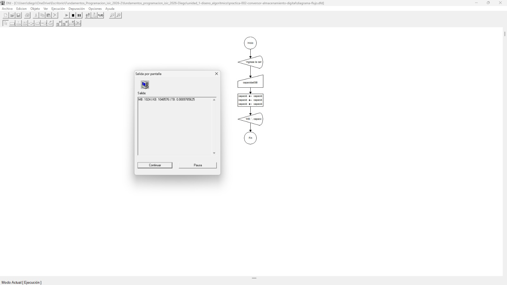
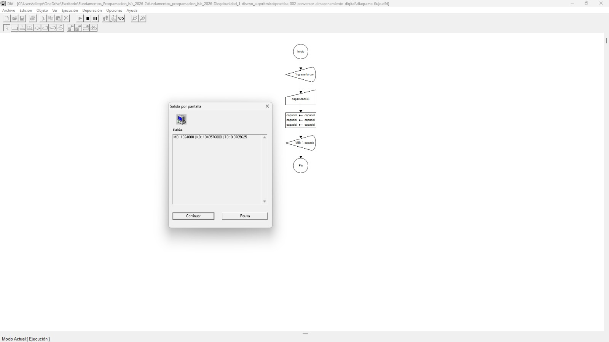
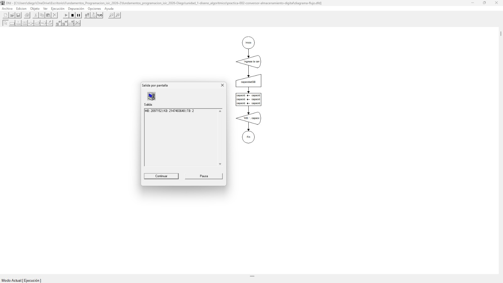

# Tabla de Casos de Prueba

Se ejecutan 3 escenarios diferentes para verificar la exactitud de las operaciones numéricas y las salidas lógicas.

| Caso | Valor de Entradas Ingresadas | Resultado Calculado / Esperado | Resultado Obtenido | Estatus (PASÓ / FALLÓ) |
| :---: | :--- | :--- | :--- | :---: |
| **1** | `capacidadGB`: 1 | MB: 1,024 KB: 1,048,576 TB: 0.0009765625 | MB: 1024 KB: 1048576 TB: 0.0009765625 | **PASÓ** |
| **2** | `capacidadGB`: 1000 | MB: 1,024,000 KB: 1,048,576,000 TB: 0.9765625 | MB: 1024000 KB: 1048576000 TB: 0.9765625 | **PASÓ** |
| **3** | `capacidadGB`: 2048 | MB: 2,097,152 KB: 2,147,483,648 TB: 2 | MB: 2097152 KB: 2147483648 TB: 2 | **PASÓ** |

## Capturas de Pantalla de Ejecución

### Caso de Prueba 1

### Caso de Prueba 2

### Caso de Prueba 3
