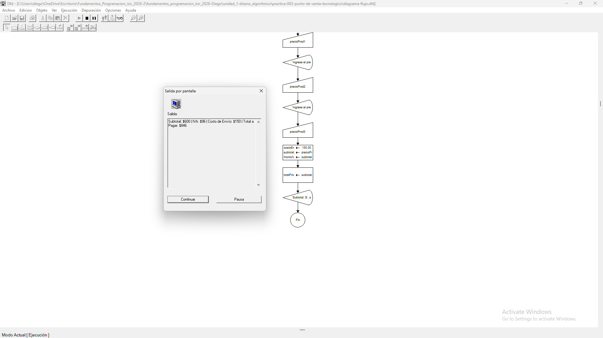
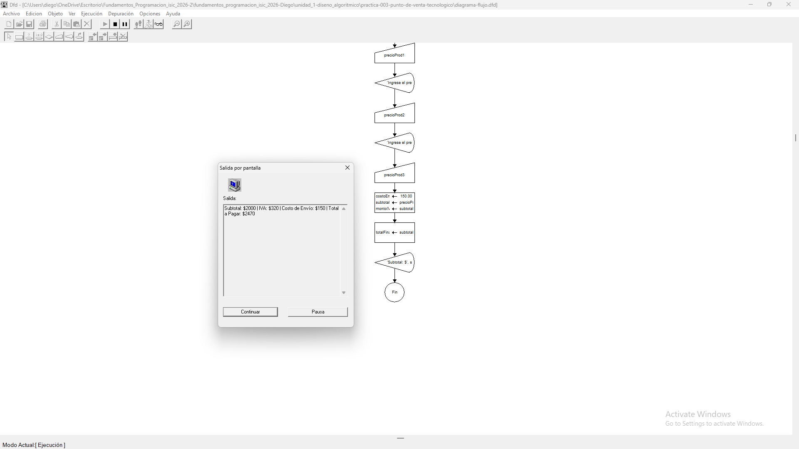
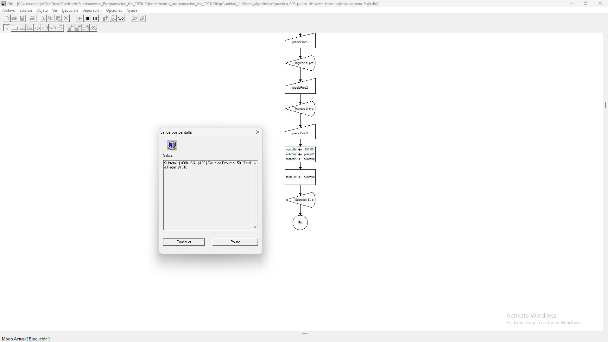

# Tabla de Casos de Prueba

Se ejecutan 3 escenarios diferentes para verificar la exactitud de los cálculos acumulados, el porcentaje de IVA (16%), el costo fijo de envío ($150.00) y el total final a pagar.

| Caso | Valor de Entradas Ingresadas | Resultado Calculado / Esperado | Resultado Obtenido | Estatus (PASÓ / FALLÓ) |
| :---: | :--- | :--- | :--- | :---: |
| **1** | `precioProd1`: 100 `precioProd2`: 200 `precioProd3`: 300 | Subtotal: $600.00 IVA: $96.00 Envío: $150.00 Total: $846.00 | Subtotal: 600 \| IVA: 96 \| Envío: 150 \| Total: 846 | **PASÓ** |
| **2** | `precioProd1`: 500 `precioProd2`: 500 `precioProd3`: 1000 | Subtotal: $2000.00 IVA: $320.00 Envío: $150.00 Total: $2470.00 | Subtotal: 2000 \| IVA: 320 \| Envío: 150 \| Total: 2470 | **PASÓ** |
| **3** | `precioProd1`: 250 `precioProd2`: 250 `precioProd3`: 500 | Subtotal: $1000.00 IVA: $160.00 Envío: $150.00 Total: $1310.00 | Subtotal: 1000 \| IVA: 160 \| Envío: 150 \| Total: 1310 | **PASÓ** |

## Capturas de Pantalla de Ejecución

### Caso de Prueba 1

### Caso de Prueba 2

### Caso de Prueba 3
