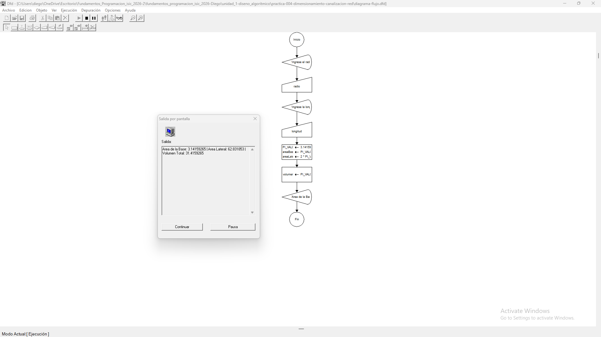
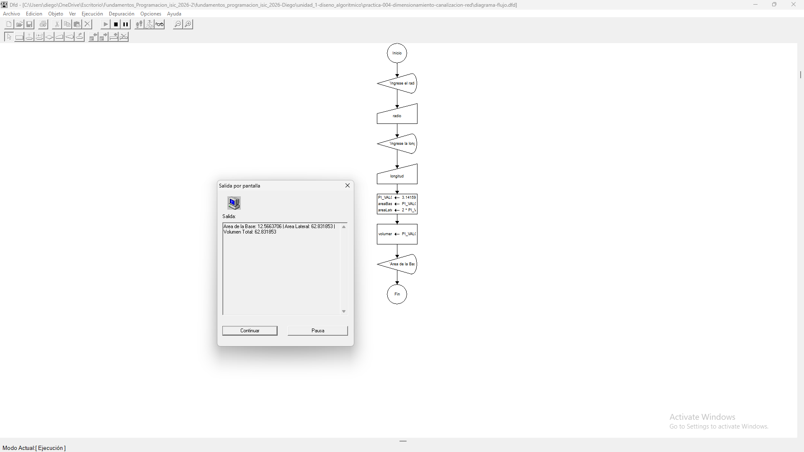
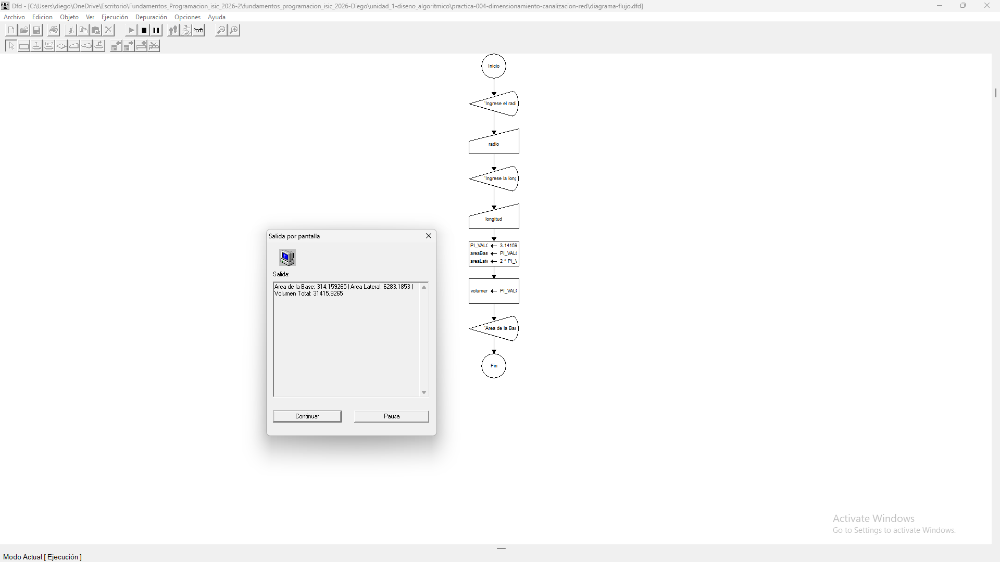

# Tabla de Casos de Prueba

Se ejecutan 3 escenarios diferentes para verificar la exactitud de las operaciones numéricas y las salidas lógicas.

| Caso | Valor de Entradas Ingresadas | Resultado Calculado / Esperado | Resultado Obtenido | Estatus (PASÓ / FALLÓ) |
| :---: | :--- | :--- | :--- | :---: |
| **1** | `radio`: 1 `longitud`: 10 | Área Base: 3.14159265 Área Lateral: 62.831853 Volumen: 31.4159265 | Área Base: 3.14159265 \| Área Lateral: 62.831853 \| Volumen: 31.4159265 | **PASÓ** |
| **2** | `radio`: 2 `longitud`: 5 | Área Base: 12.5663706 Área Lateral: 62.831853 Volumen: 62.831853 | Área Base: 12.5663706 \| Área Lateral: 62.831853 \| Volumen: 62.831853 | **PASÓ** |
| **3** | `radio`: 10 `longitud`: 100 | Área Base: 314.159265 Área Lateral: 6283.1853 Volumen: 31415.9265 | Área Base: 314.159265 \| Área Lateral: 6283.1853 \| Volumen: 31415.9265 | **PASÓ** |

## Capturas de Pantalla de Ejecución

### Caso de Prueba 1

### Caso de Prueba 2

### Caso de Prueba 3
