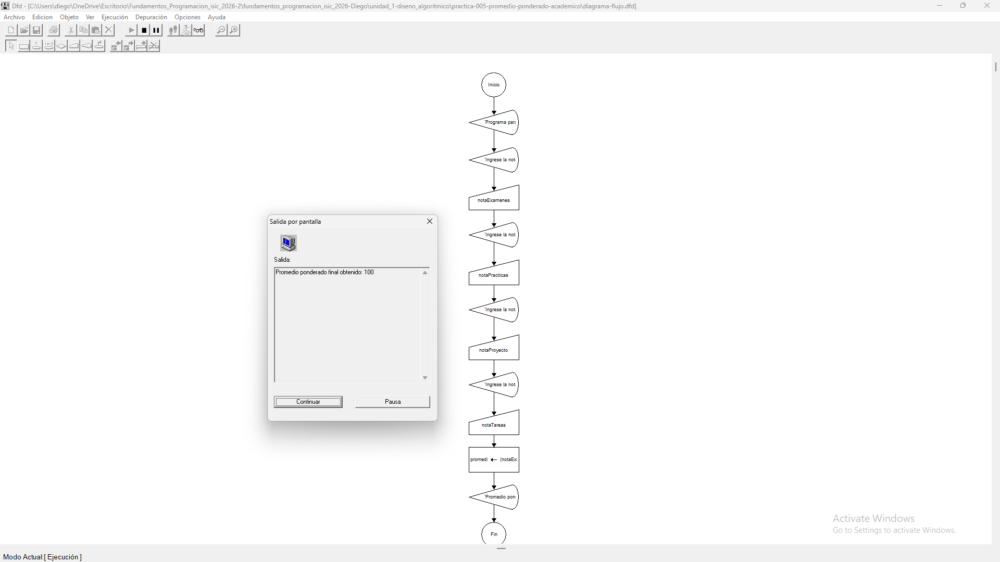
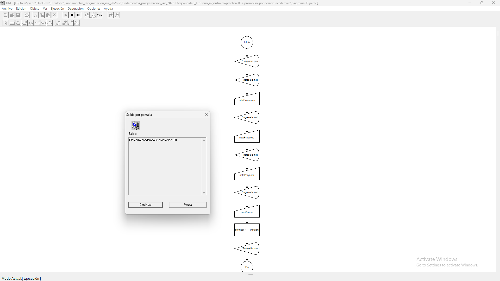
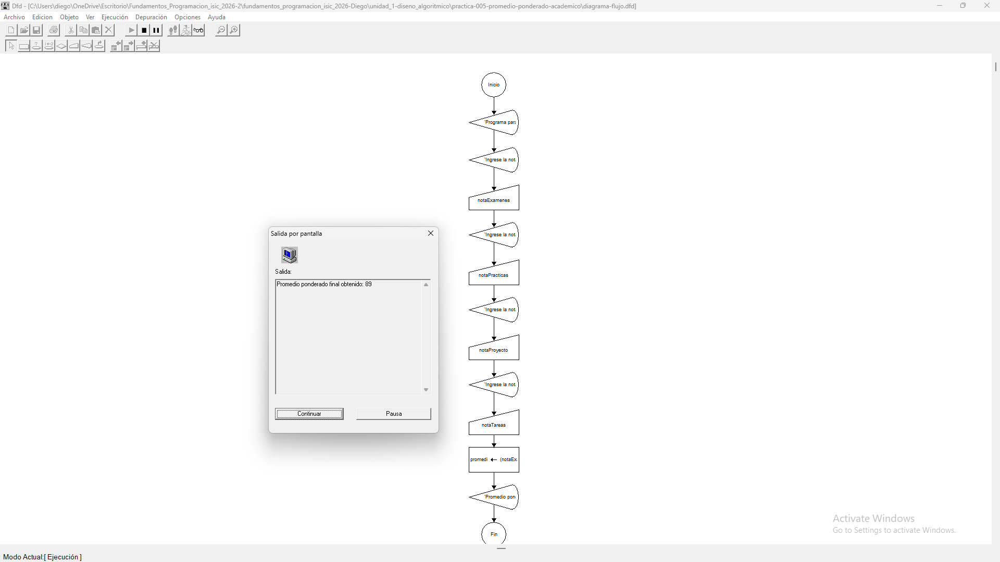

# Tabla de Casos de Prueba

Se ejecutan 3 escenarios diferentes para verificar la exactitud de las operaciones numéricas y las salidas lógicas.

| Caso | Valor de Entradas Ingresadas | Resultado Calculado / Esperado | Resultado Obtenido | Estatus (PASÓ / FALLÓ) |
| :---: | :--- | :--- | :--- | :---: |
| **1** | `notaExamenes`: 100 `notaPracticas`: 100 `notaProyecto`: 100 `notaTareas`: 100 | Promedio Final: 100 | Promedio Final: 100 | **PASÓ** |
| **2** | `notaExamenes`: 80 `notaPracticas`: 80 `notaProyecto`: 80 `notaTareas`: 80 | Promedio Final: 80 | Promedio Final: 80 | **PASÓ** |
| **3** | `notaExamenes`: 100 `notaPracticas`: 80 `notaProyecto`: 90 `notaTareas`: 70 | Promedio Final: 89 | Promedio Final: 89 | **PASÓ** |

## Capturas de Pantalla de Ejecución

### Caso de Prueba 1

### Caso de Prueba 2

### Caso de Prueba 3
