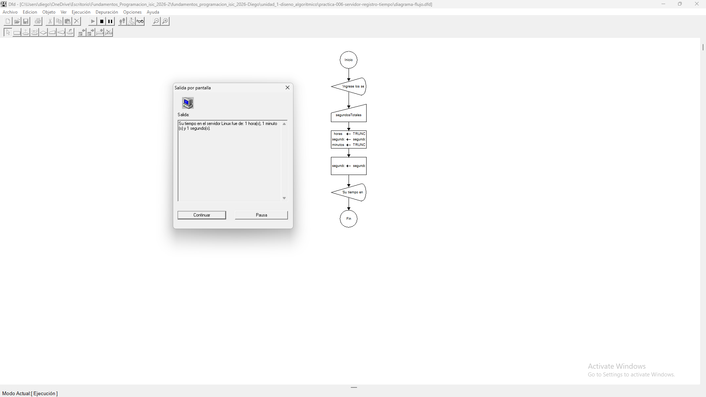
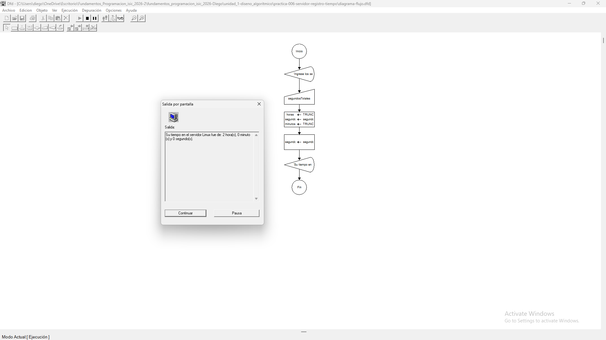
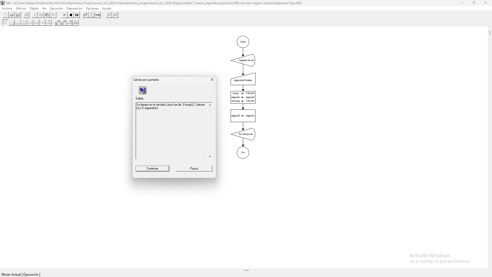

# Tabla de Casos de Prueba

Se ejecutan 3 escenarios diferentes para verificar la exactitud de las operaciones numéricas y las salidas lógicas.

| Caso | Valor de Entradas Ingresadas | Resultado Calculado / Esperado | Resultado Obtenido | Estatus (PASÓ / FALLÓ) |
| :---: | :--- | :--- | :--- | :---: |
| **1** | `segundosTotales`: 3661 | Horas: 1 Minutos: 1 Segundos: 1 | Horas: 1 \| Minutos: 1 \| Segundos: 1 | **PASÓ** |
| **2** | `segundosTotales`: 7200 | Horas: 2 Minutos: 0 Segundos: 0 | Horas: 2 \| Minutos: 0 \| Segundos: 0 | **PASÓ** |
| **3** | `segundosTotales`: 125 | Horas: 0 Minutos: 2 Segundos: 5 | Horas: 0 \| Minutos: 2 \| Segundos: 5 | **PASÓ** |

## Capturas de Pantalla de Ejecución

### Caso de Prueba 1

### Caso de Prueba 2

### Caso de Prueba 3
