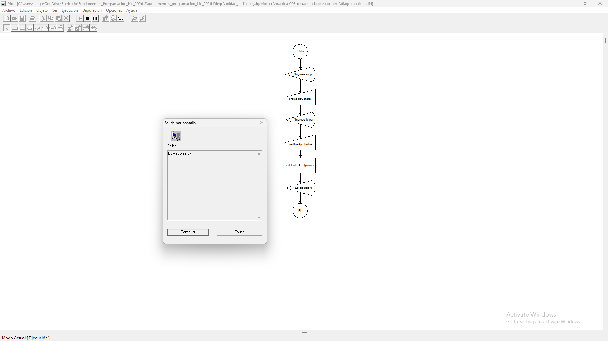
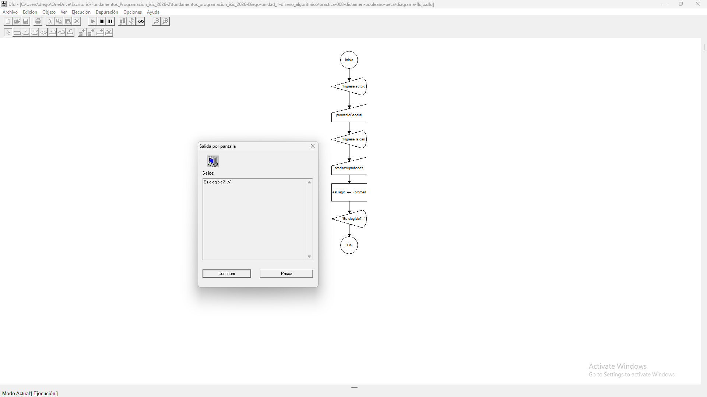
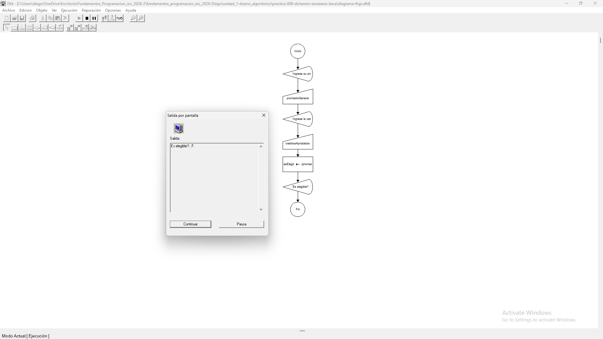

# Tabla de Casos de Prueba

Se ejecutan 3 escenarios diferentes para verificar la exactitud de las operaciones numéricas y las salidas lógicas.

| Caso | Valor de Entradas Ingresadas | Resultado Calculado / Esperado | Resultado Obtenido | Estatus (PASÓ / FALLÓ) |
| :---: | :--- | :--- | :--- | :---: |
| **1** | `promedioGeneral`: 90.0 `creditosAprobados`: 50 | Elegible: VERDADERO | Elegible: VERDADERO | **PASÓ** |
| **2** | `promedioGeneral`: 85.0 `creditosAprobados`: 45 | Elegible: VERDADERO | Elegible: VERDADERO | **PASÓ** |
| **3** | `promedioGeneral`: 90.0 `creditosAprobados`: 40 | Elegible: FALSO | Elegible: FALSO | **PASÓ** |

## Capturas de Pantalla de Ejecución

### Caso de Prueba 1

### Caso de Prueba 2

### Caso de Prueba 3
