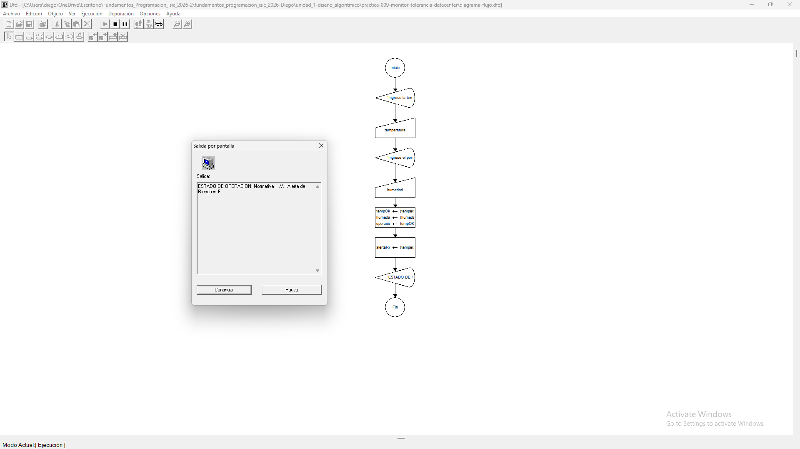
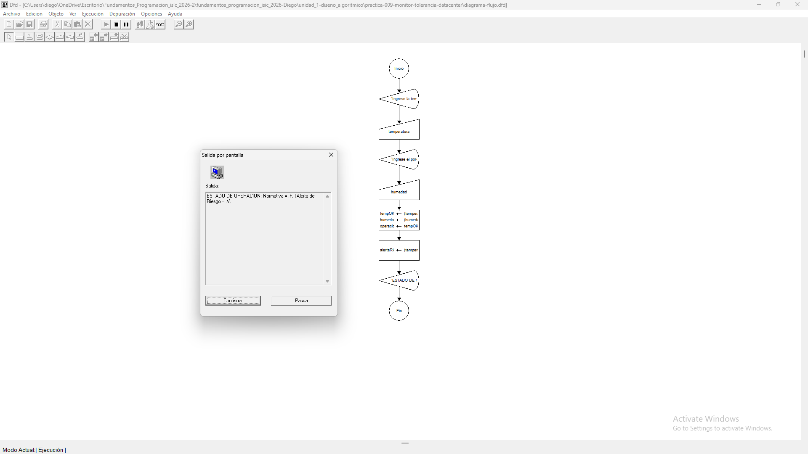

# Tabla de Casos de Prueba

Se ejecutan 3 escenarios diferentes para verificar la exactitud de las operaciones numéricas y las salidas lógicas.

| Caso | Valor de Entradas Ingresadas | Resultado Calculado / Esperado | Resultado Obtenido | Estatus (PASÓ / FALLÓ) |
| :---: | :--- | :--- | :--- | :---: |
| **1** | `temperatura`: 20.0 `humedad`: 50.0 | Normativa: VERDADERO Alerta Riesgo: FALSO | Normativa: VERDADERO \| Alerta Riesgo: FALSO | **PASÓ** |
| **2** | `temperatura`: 26.0 `humedad`: 50.0 | Normativa: FALSO Alerta Riesgo: VERDADERO | Normativa: FALSO \| Alerta Riesgo: VERDADERO | **PASÓ** |
| **3** | `temperatura`: 20.0 `humedad`: 70.0 | Normativa: FALSO Alerta Riesgo: VERDADERO | Normativa: FALSO \| Alerta Riesgo: VERDADERO | **PASÓ** |

## Capturas de Pantalla de Ejecución

### Caso de Prueba 1

### Caso de Prueba 2

### Caso de Prueba 3
