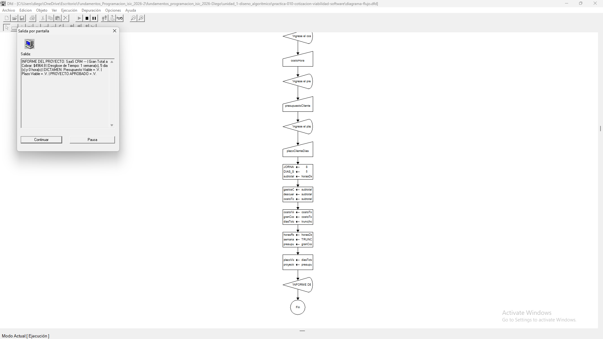
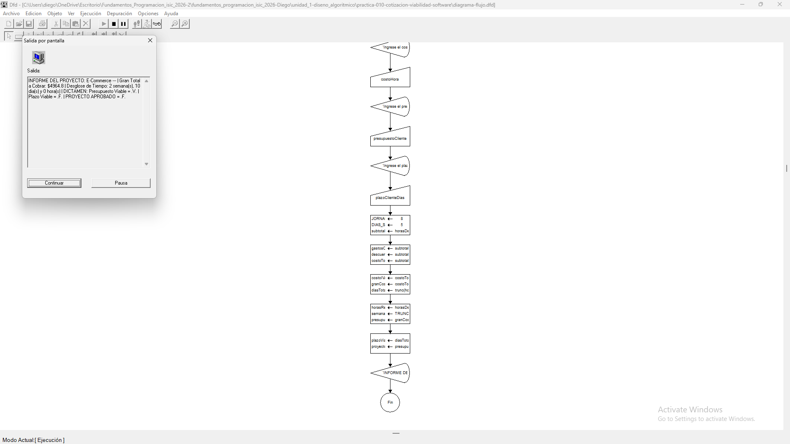

# Tabla de Casos de Prueba

Se ejecutan 3 escenarios diferentes para verificar la exactitud de las operaciones numéricas y las salidas lógicas.

| Caso | Valor de Entradas Ingresadas | Resultado Calculado / Esperado | Resultado Obtenido | Estatus (PASÓ / FALLÓ) |
| :---: | :--- | :--- | :--- | :---: |
| **1** | `nombreProyecto`: SaaS CRM `horasDesarrollo`: 40 `costoHora`: 100 `presupuestoCliente`: 6000 `plazoClienteDias`: 10 | Gran Total: $4779.20 Tiempo: 1 sem, 5 dias, 0 hrs Aprobado: VERDADERO | Gran Total: $4779.20 \| Tiempo: 1 sem, 5 dias, 0 hrs \| Aprobado: VERDADERO | **PASÓ** |
| **2** | `nombreProyecto`: App Movil `horasDesarrollo`: 100 `costoHora`: 100 `presupuestoCliente`: 10000 `plazoClienteDias`: 20 | Gran Total: $11948.00 Tiempo: 2 sem, 12 dias, 4 hrs Aprobado: FALSO | Gran Total: $11948.00 \| Tiempo: 2 sem, 12 dias, 4 hrs \| Aprobado: FALSO | **PASÓ** |
| **3** | `nombreProyecto`: E-commerce `horasDesarrollo`: 80 `costoHora`: 50 `presupuestoCliente`: 6000 `plazoClienteDias`: 5 | Gran Total: $4779.20 Tiempo: 2 sem, 10 dias, 0 hrs Aprobado: FALSO | Gran Total: $4779.20 \| Tiempo: 2 sem, 10 dias, 0 hrs \| Aprobado: FALSO | **PASÓ** |

## Capturas de Pantalla de Ejecución

### Caso de Prueba 1

### Caso de Prueba 2

### Caso de Prueba 3
