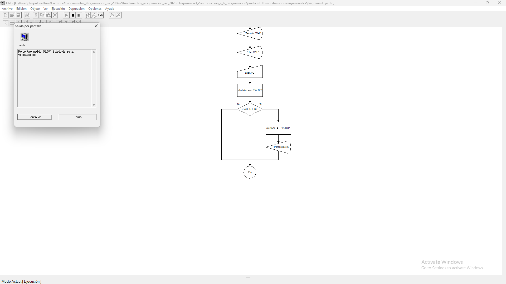

# Tabla de Casos de Prueba

Se ejecutan 3 escenarios diferentes para verificar la evaluación de la estructura selectiva simple.

| Caso | Valor de Entradas Ingresadas | Resultado Calculado / Esperado | Resultado Obtenido | Estatus (PASÓ / FALLÓ) |
| :---: | :--- | :--- | :--- | :---: |
| **1** | `usoCPU`: 92.5 | Muestra mensaje de alerta. alertaActivada: VERDADERO | Muestra mensaje de alerta. alertaActivada: VERDADERO | **PASÓ** |
| **2** | `usoCPU`: 85.0 | No muestra alerta. alertaActivada: FALSO | No muestra alerta. alertaActivada: FALSO | **PASÓ** |
| **3** | `usoCPU`: 45.0 | No muestra alerta. alertaActivada: FALSO | No muestra alerta. alertaActivada: FALSO | **PASÓ** |

## Capturas de Pantalla de Ejecución

### Caso de Prueba 1

### Caso de Prueba 2

### Caso de Prueba 3
