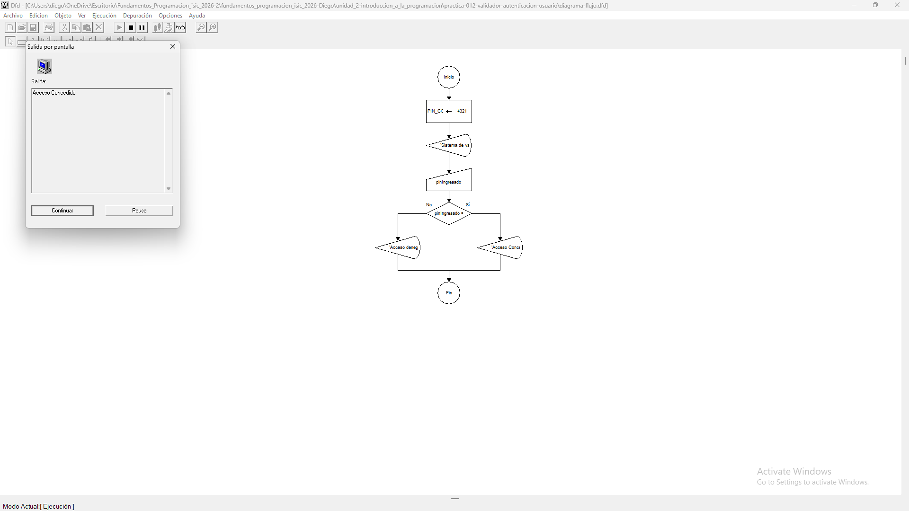
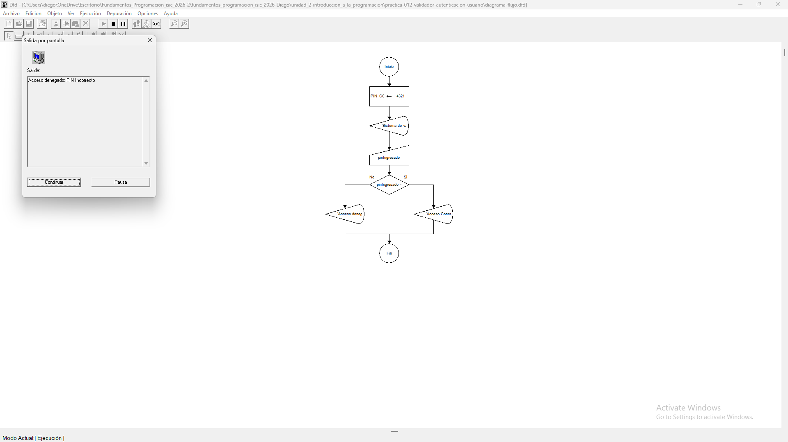

# Tabla de Casos de Prueba

Se ejecutan 3 escenarios diferentes para verificar la estructura selectiva doble de autenticación.

| Caso | Valor de Entradas Ingresadas | Resultado Calculado / Esperado | Resultado Obtenido | Estatus (PASÓ / FALLÓ) |
| :---: | :--- | :--- | :--- | :---: |
| **1** | `pinIngresado`: 4321 | Acceso Concedido | Acceso Concedido | **PASÓ** |
| **2** | `pinIngresado`: 1234 | Acceso Denegado: PIN Incorrecto | Acceso Denegado: PIN Incorrecto | **PASÓ** |
| **3** | `pinIngresado`: 0000 | Acceso Denegado: PIN Incorrecto | Acceso Denegado: PIN Incorrecto | **PASÓ** |

## Capturas de Pantalla de Ejecución

### Caso de Prueba 1

### Caso de Prueba 2

### Caso de Prueba 3
