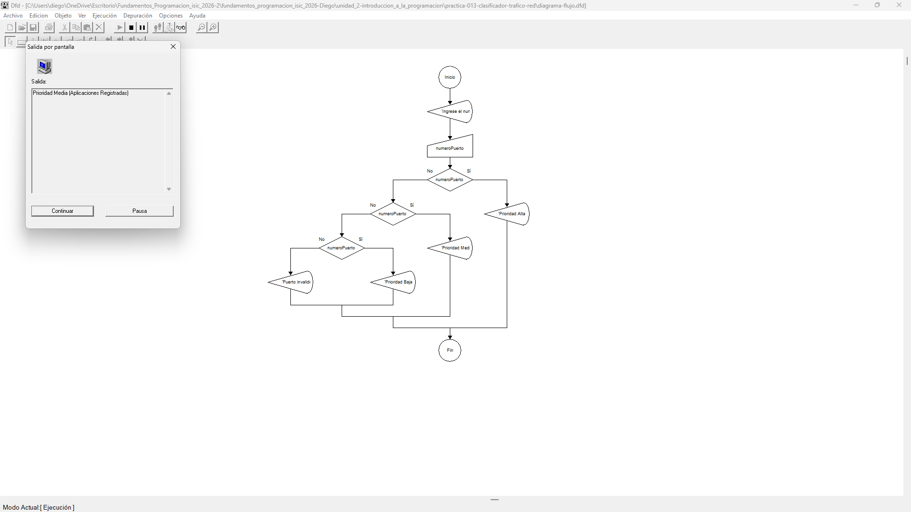
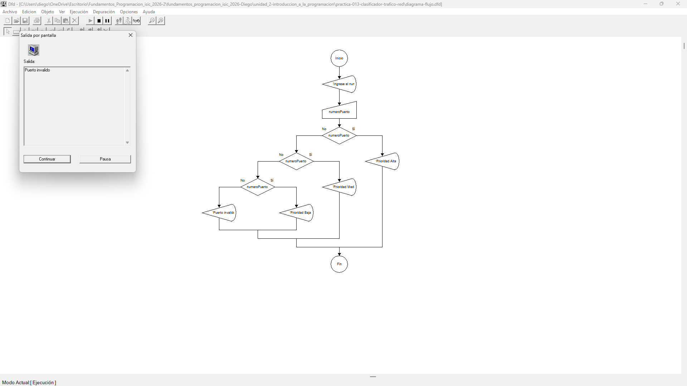

# Tabla de Casos de Prueba

Se ejecutan escenificatorios para verificar la clasificación por rangos numéricos anidados.

| Caso | Valor de Entradas Ingresadas | Resultado Calculado / Esperado | Resultado Obtenido | Estatus (PASÓ / FALLÓ) |
| :---: | :--- | :--- | :--- | :---: |
| **1** | `numeroPuerto`: 80 | Prioridad Alta (Servicios del Sistema) | Prioridad Alta (Servicios del Sistema) | **PASÓ** |
| **2** | `numeroPuerto`: 8080 | Prioridad Media (Aplicaciones Registradas) | Prioridad Media (Aplicaciones Registradas) | **PASÓ** |
| **3** | `numeroPuerto`: 50000 | Prioridad Baja (Puertos Dinamicos/Privados) | Prioridad Baja (Puertos Dinamicos/Privados) | **PASÓ** |
| **4** | `numeroPuerto`: 70000 | Puerto Invalido | Puerto Invalido | **PASÓ** |

## Capturas de Pantalla de Ejecución

### Caso de Prueba 1

### Caso de Prueba 2

### Caso de Prueba 3

### Caso de Prueba 4
