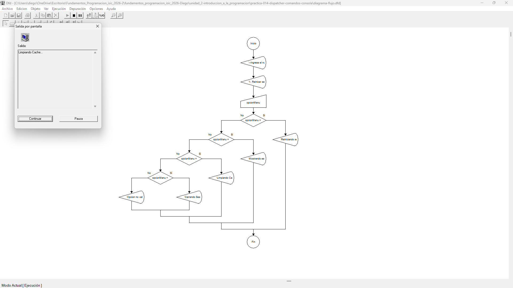

# Tabla de Casos de Prueba

Se ejecutan 3 escenarios diferentes para verificar la exactitud de las operaciones numéricas y las salidas lógicas.

| Caso | Valor de Entradas Ingresadas | Resultado Calculado / Esperado | Resultado Obtenido | Estatus (PASÓ / FALLÓ) |
| :---: | :--- | :--- | :--- | :---: |
| **1** | `opcionMenu`: 1 | Ejecutando: Reiniciar servidor... | Ejecutando: Reiniciar servidor... | **PASÓ** |
| **2** | `opcionMenu`: 3 | Ejecutando: Limpiar cache... | Ejecutando: Limpiar cache... | **PASÓ** |
| **3** | `opcionMenu`: 9 | Error: Opcion no valida. Seleccione un numero del 1 al 4. | Error: Opcion no valida. Seleccione un numero del 1 al 4. | **PASÓ** |

## Capturas de Pantalla de Ejecución

### Caso de Prueba 1

### Caso de Prueba 2

### Caso de Prueba 3
