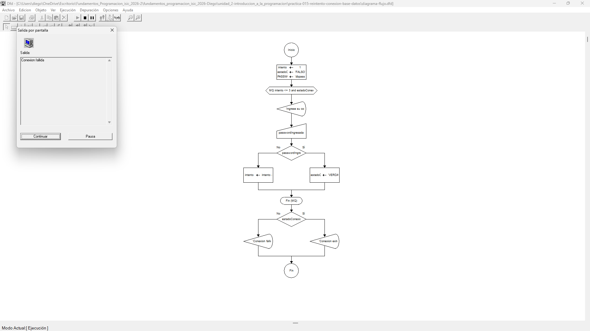

# Tabla de Casos de Prueba

Se ejecutan 3 escenarios diferentes para verificar la exactitud de las operaciones numéricas y las salidas lógicas.

| Caso | Valor de Entradas Ingresadas | Resultado Calculado / Esperado | Resultado Obtenido | Estatus (PASÓ / FALLÓ) |
| :---: | :--- | :--- | :--- | :---: |
| **1** | `passwordIngresada`: "dbpass123" (en el primer intento) | Conexion establecida exitosamente con el servidor. | Conexion establecida exitosamente con el servidor. | **PASÓ** |
| **2** | `passwordIngresada`: "error1", "error2", "dbpass123" (al tercer intento) | Contrasena incorrecta. Contrasena incorrecta. Conexion establecida exitosamente con el servidor. | Contrasena incorrecta. Contrasena incorrecta. Conexion establecida exitosamente con el servidor. | **PASÓ** |
| **3** | `passwordIngresada`: "bad1", "bad2", "bad3" (falla los 3 intentos) | Contrasena incorrecta. Contrasena incorrecta. Contrasena incorrecta. Conexion fallida: Se ha alcanzado el limite maximo de 3 intentos. | Contrasena incorrecta. Contrasena incorrecta. Contrasena incorrecta. Conexion fallida: Se ha alcanzado el limite maximo de 3 intentos. | **PASÓ** |

## Capturas de Pantalla de Ejecución

### Caso de Prueba 1

### Caso de Prueba 2

### Caso de Prueba 3
