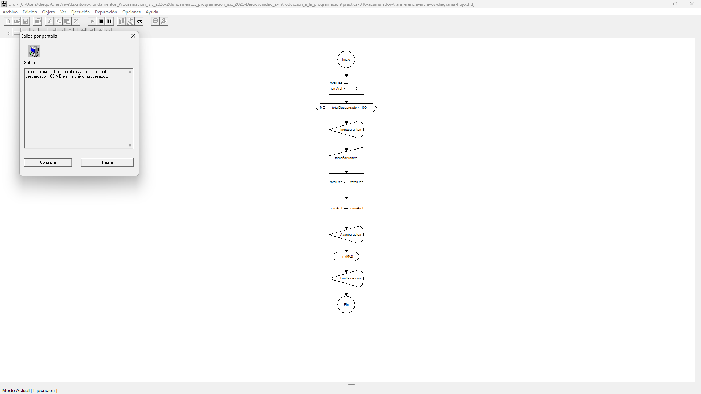

# Tabla de Casos de Prueba

Se ejecutan 3 escenarios diferentes para verificar la exactitud de las operaciones numéricas y las salidas lógicas.

| Caso | Valor de Entradas Ingresadas | Resultado Calculado / Esperado | Resultado Obtenido | Estatus (PASÓ / FALLÓ) |
| :---: | :--- | :--- | :--- | :---: |
| **1** | `tamanoArchivo`: 100.0 (en 1 solo archivo) | Avance actual: 100 MB \| Archivos procesados: 1 'Limite de cuota de datos alcanzado. Total final descargado: 100 MB en 1 archivos procesados.' | Avance actual: 100 MB \| Archivos procesados: 1 'Limite de cuota de datos alcanzado. Total final descargado: 100 MB en 1 archivos procesados.' | **PASÓ** |
| **2** | `tamanoArchivo`: 45.5, 60.0 (en 2 archivos) | Avance actual: 45.5 MB \| Archivos procesados: 1 Avance actual: 105.5 MB \| Archivos procesados: 2 'Limite de cuota de datos alcanzado. Total final descargado: 105.5 MB en 2 archivos procesados.' | Avance actual: 45.5 MB \| Archivos procesados: 1 Avance actual: 105.5 MB \| Archivos procesados: 2 'Limite de cuota de datos alcanzado. Total final descargado: 105.5 MB en 2 archivos procesados.' | **PASÓ** |
| **3** | `tamanoArchivo`: 30.0, 30.0, 30.0, 20.0 (en 4 archivos) | Avance actual: 30 MB \| Archivos procesados: 1 Avance actual: 60 MB \| Archivos procesados: 2 Avance actual: 90 MB \| Archivos procesados: 3 Avance actual: 110 MB \| Archivos procesados: 4 'Limite de cuota de datos alcanzado. Total final descargado: 110 MB en 4 archivos procesados.' | Avance actual: 30 MB \| Archivos procesados: 1 Avance actual: 60 MB \| Archivos procesados: 2 Avance actual: 90 MB \| Archivos procesados: 3 Avance actual: 110 MB \| Archivos procesados: 4 'Limite de cuota de datos alcanzado. Total final descargado: 110 MB en 4 archivos procesados.' | **PASÓ** |

## Capturas de Pantalla de Ejecución

### Caso de Prueba 1

### Caso de Prueba 2

### Caso de Prueba 3
