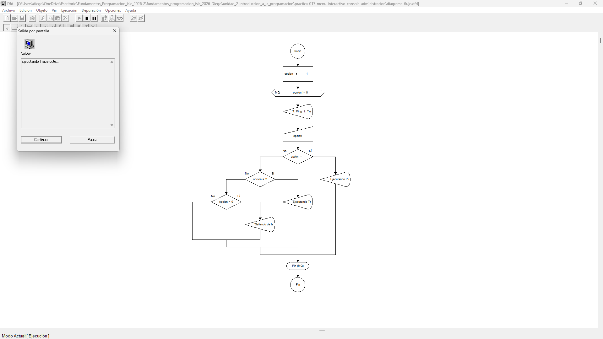

# Tabla de Casos de Prueba

Se ejecutan 3 escenarios diferentes para verificar el comportamiento del menú interactivo ante distintas entradas del usuario.

| Caso | Valor de Entrada Ingresada (`opcion`) | Resultado Calculado / Esperado | Resultado Obtenido | Estatus (PASÓ / FALLÓ) |
| :---: | :--- | :--- | :--- | :---: |
| **1** | `1` | 'Ejecutando Ping al servidor...' | 'Ejecutando Ping al servidor...' | **PASÓ** |
| **2** | `2` | 'Ejecutando Traceroute...' | 'Ejecutando Traceroute...' | **PASÓ** |
| **3** | `0` | 'Saliendo de la consola de administracion.' | 'Saliendo de la consola de administracion.' | **PASÓ** |

## Capturas de Pantalla de Ejecución

### Caso de Prueba 1

### Caso de Prueba 2

### Caso de Prueba 3
