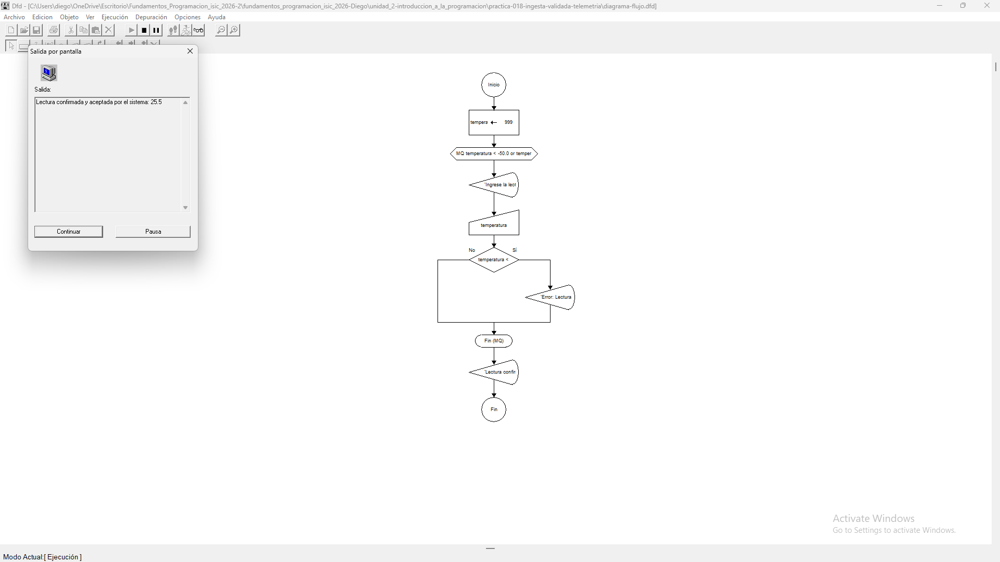

# Tabla de Casos de Prueba

Se ejecutan 3 escenarios diferentes para verificar la validación de la temperatura dentro y fuera del rango operacional de -50.0 °C a 100.0 °C.

| Caso | Valor de Entrada Ingresada (`temperatura`) | Resultado Calculado / Esperado | Resultado Obtenido | Estatus (PASÓ / FALLÓ) |
| :---: | :--- | :--- | :--- | :---: |
| **1** | `25.5` | 'Lectura confirmada y aceptada por el sistema: 25.5' | 'Lectura confirmada y aceptada por el sistema: 25.5' | **PASÓ** |
| **2** | `-60.0` | 'Error: Lectura invalida fuera de rango. Reintentar.' | 'Error: Lectura invalida fuera de rango. Reintentar.' | **PASÓ** |
| **3** | `120.0` | 'Error: Lectura invalida fuera de rango. Reintentar.' | 'Error: Lectura invalida fuera de rango. Reintentar.' | **PASÓ** |

## Capturas de Pantalla de Ejecución

### Caso de Prueba 1

### Caso de Prueba 2

### Caso de Prueba 3
