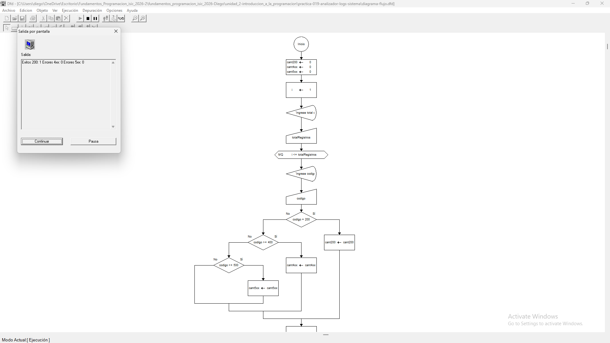

# Tabla de Casos de Prueba

Se ejecutan 3 escenarios diferentes para verificar la correcta clasificación y contabilización de los códigos de estado HTTP en el lote de registros.

| Caso | Valor de Entradas Ingresadas | Resultado Calculado / Esperado | Resultado Obtenido | Estatus (PASÓ / FALLÓ) |
| :---: | :--- | :--- | :--- | :---: |
| **1** | `totalRegistros`: 1 `codigoHTTP`: 200 | Exitos (200): 1 \| Errores 4xx: 0 \| Errores 5xx: 0 | Exitos (200): 1 \| Errores 4xx: 0 \| Errores 5xx: 0 | **PASÓ** |
| **2** | `totalRegistros`: 1 `codigoHTTP`: 404 | Exitos (200): 0 \| Errores 4xx: 1 \| Errores 5xx: 0 | Exitos (200): 0 \| Errores 4xx: 1 \| Errores 5xx: 0 | **PASÓ** |
| **3** | `totalRegistros`: 1 `codigoHTTP`: 500 | Exitos (200): 0 \| Errores 4xx: 0 \| Errores 5xx: 1 | Exitos (200): 0 \| Errores 4xx: 0 \| Errores 5xx: 1 | **PASÓ** |

## Capturas de Pantalla de Ejecución

### Caso de Prueba 1

### Caso de Prueba 2

### Caso de Prueba 3
