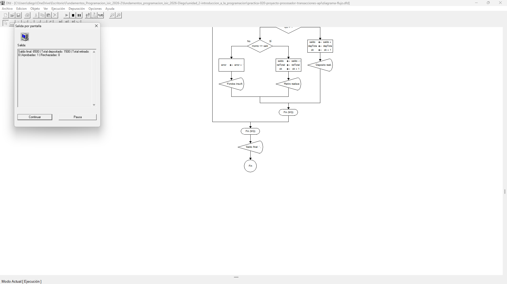
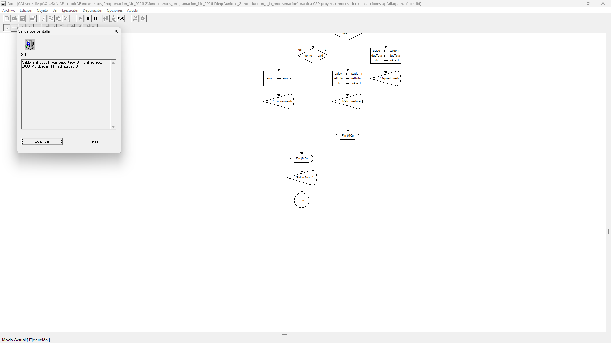

# Tabla de Casos de Prueba

Se ejecutan 3 escenarios individuales para evaluar el depósito exitoso, un retiro válido dentro del saldo disponible y un intento de retiro que supera el saldo inicial de $5000.0.

| Caso | Valor de Entrada Ingresada | Resultado Calculado / Esperado | Resultado Obtenido | Estatus (PASÓ / FALLÓ) |
| :---: | :--- | :--- | :--- | :---: |
| **1** | `1` | 'Deposito ok'   Saldo final: 6500.0 \| Dep: 1500.0 \| Ret: 0.0 \| Ok: 1 \| Error: 0 | Saldo final: 6500.0 \| Dep: 1500.0 \| Ret: 0.0 \| Ok: 1 \| Error: 0 | **PASÓ** |
| **2** | `2` | 'Retiro ok'   Saldo final: 3000.0 \| Dep: 0.0 \| Ret: 2000.0 \| Ok: 1 \| Error: 0 | Saldo final: 3000.0 \| Dep: 0.0 \| Ret: 2000.0 \| Ok: 1 \| Error: 0 | **PASÓ** |
| **3** | `2` | 'Fondos Insuficientes'   Saldo final: 5000.0 \| Dep: 0.0 \| Ret: 0.0 \| Ok: 0 \| Error: 1 | Saldo final: 5000.0 \| Dep: 0.0 \| Ret: 0.0 \| Ok: 0 \| Error: 1 | **PASÓ** |

## Capturas de Pantalla de Ejecución

### Caso de Prueba 1

### Caso de Prueba 2

### Caso de Prueba 3
