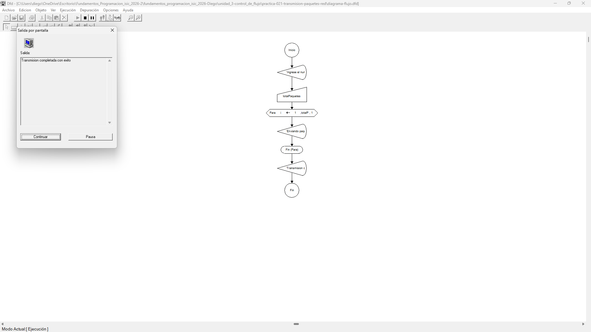

# Tabla de Casos de Prueba

Se ejecutan 3 escenarios diferentes para verificar el comportamiento de la estructura repetitiva `Para` al simular la transmisión de distintos volúmenes de paquetes de red.

| Caso | Valor de Entrada Ingresada (`totalPaquetes`) | Resultado Calculado / Esperado | Resultado Obtenido | Estatus (PASÓ / FALLÓ) |
| :---: | :--- | :--- | :--- | :---: |
| **1** | `1` | 'Enviando paquete 1 de 1...'   'Transmisión completada con éxito.' | 'Enviando paquete 1 de 1...'   'Transmisión completada con éxito.' | **PASÓ** |
| **2** | `3` | 'Enviando paquete 1 de 3...'   'Enviando paquete 2 de 3...'   'Enviando paquete 3 de 3...'   'Transmisión completada con éxito.' | 'Enviando paquete 1 de 3...'   'Enviando paquete 2 de 3...'   'Enviando paquete 3 de 3...'   'Transmisión completada con éxito.' | **PASÓ** |
| **3** | `0` | 'Transmisión completada con éxito.' | 'Transmisión completada con éxito.' | **PASÓ** |

## Capturas de Pantalla de Ejecución

### Caso de Prueba 1

### Caso de Prueba 2

### Caso de Prueba 3
