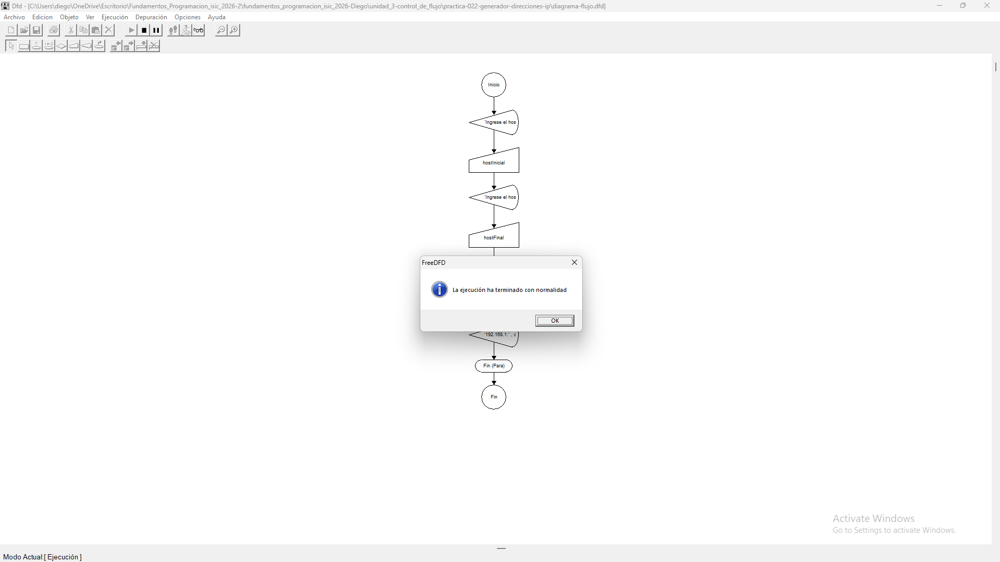
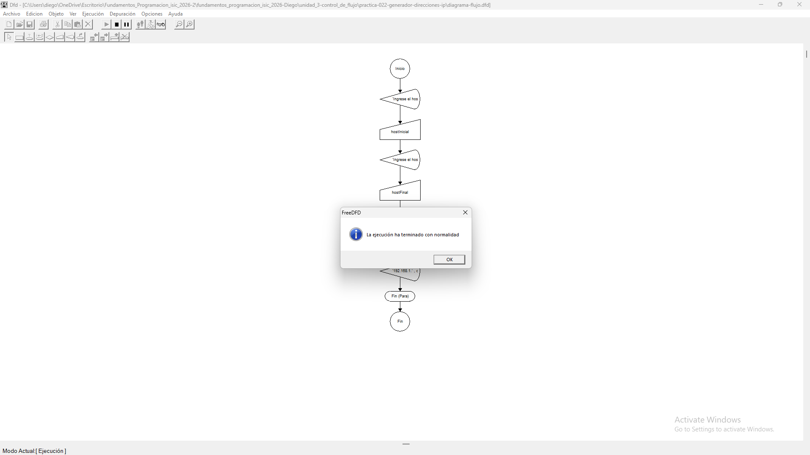
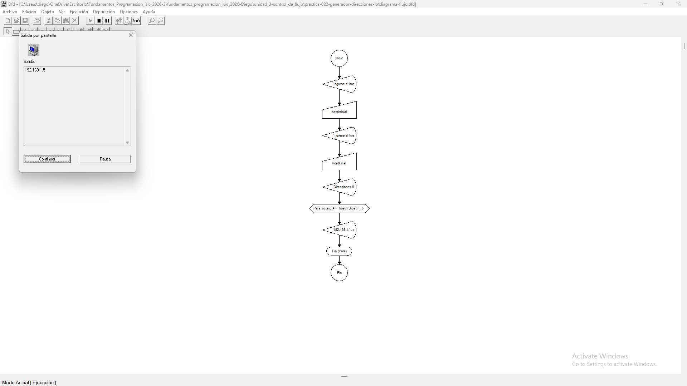

# Tabla de Casos de Prueba

Se ejecutan 3 escenarios para evaluar la generación de secuencias IP con saltos de 5 en 5 dentro del último octeto.

| Caso | Valor de Entradas Ingresadas | Resultado Calculado / Esperado | Resultado Obtenido | Estatus (PASÓ / FALLÓ) |
| :---: | :--- | :--- | :--- | :---: |
| **1** | `hostInicial`: 10   `hostFinal`: 20 | '192.168.1.10'   '192.168.1.15'   '192.168.1.20' | '192.168.1.10'   '192.168.1.15'   '192.168.1.20' | **PASÓ** |
| **2** | `hostInicial`: 1   `hostFinal`: 12 | '192.168.1.1'   '192.168.1.6'   '192.168.1.11' | '192.168.1.1'   '192.168.1.6'   '192.168.1.11' | **PASÓ** |
| **3** | `hostInicial`: 5   `hostFinal`: 5 | '192.168.1.5' | '192.168.1.5' | **PASÓ** |

## Capturas de Pantalla de Ejecución

### Caso de Prueba 1

### Caso de Prueba 2

### Caso de Prueba 3
