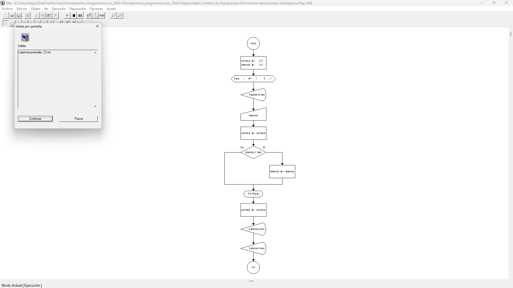
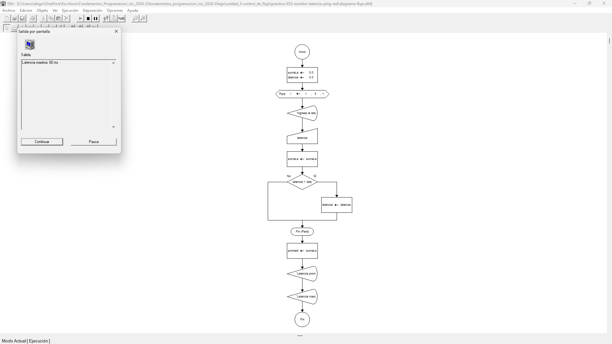

# Tabla de Casos de Prueba

Se ejecutan 3 escenarios para evaluar el cálculo de la latencia promedio y la búsqueda de la latencia máxima (peor caso) sobre un lote fijo de 5 muestras[cite: 4]. Cada ejecución cuenta con dos capturas de pantalla complementarias: una para la captura del proceso de ingreso y otra para el reporte final de resultados.

| Caso | Valores de Entrada Ingresados (5 pruebas) | Resultado Calculado / Esperado | Resultado Obtenido | Estatus (PASÓ / FALLÓ) |
| :---: | :--- | :--- | :--- | :---: |
| **1** | `20`, `25`, `22`, `30`, `18` | Promedio: 23.0 ms   Máxima: 30.0 ms | Promedio: 23.0 ms   Máxima: 30.0 ms | **PASÓ** |
| **2** | `10`, `15`, `12`, `14`, `11` | Promedio: 12.4 ms   Máxima: 15.0 ms | Promedio: 12.4 ms   Máxima: 15.0 ms | **PASÓ** |
| **3** | `50`, `45`, `60`, `55`, `40` | Promedio: 50.0 ms   Máxima: 60.0 ms | Promedio: 50.0 ms   Máxima: 60.0 ms | **PASÓ** |

## Capturas de Pantalla de Ejecución

### Caso de Prueba 1
* **Captura 1 (Ingreso de muestras):**
  
* **Captura 2 (Resultados - Promedio y Máxima):**
  

### Caso de Prueba 2
* **Captura 1 (Ingreso de muestras):**
  
* **Captura 2 (Resultados - Promedio y Máxima):**
  

### Caso de Prueba 3
* **Captura 1 (Ingreso de muestras):**
  
* **Captura 2 (Resultados - Promedio y Máxima):**
  