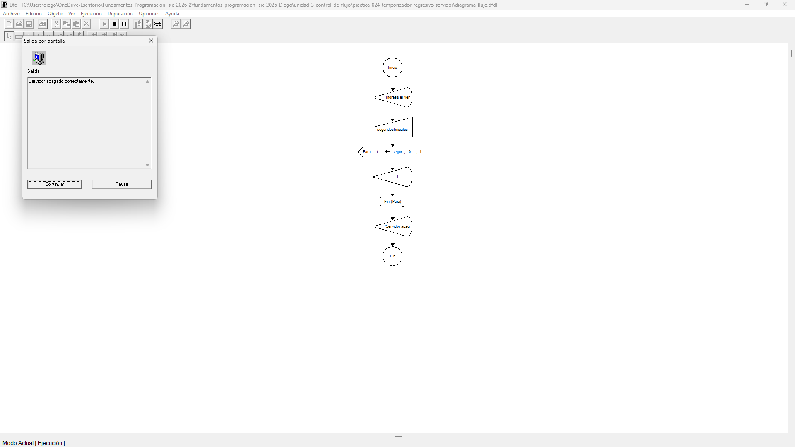

# Tabla de Casos de Prueba

Se ejecutan 3 escenarios para evaluar la estructura `Para` decreciente (`Con Paso -1`) simulando una cuenta regresiva de apagado hasta llegar a 0.

| Caso | Valor de Entrada Ingresado (`segundosIniciales`) | Resultado Calculado / Esperado | Resultado Obtenido | Estatus (PASÓ / FALLÓ) |
| :---: | :--- | :--- | :--- | :---: |
| **1** | `3` | Conteo de 3 a 0   'Servidor Apagado Correctamente' | Conteo de 3 a 0   'Servidor Apagado Correctamente' | **PASÓ** |
| **2** | `5` | Conteo de 5 a 0   'Servidor Apagado Correctamente' | Conteo de 5 a 0   'Servidor Apagado Correctamente' | **PASÓ** |
| **3** | `1` | Conteo de 1 a 0   'Servidor Apagado Correctamente' | Conteo de 1 a 0   'Servidor Apagado Correctamente' | **PASÓ** |

## Capturas de Pantalla de Ejecución

### Caso de Prueba 1

### Caso de Prueba 2

### Caso de Prueba 3
